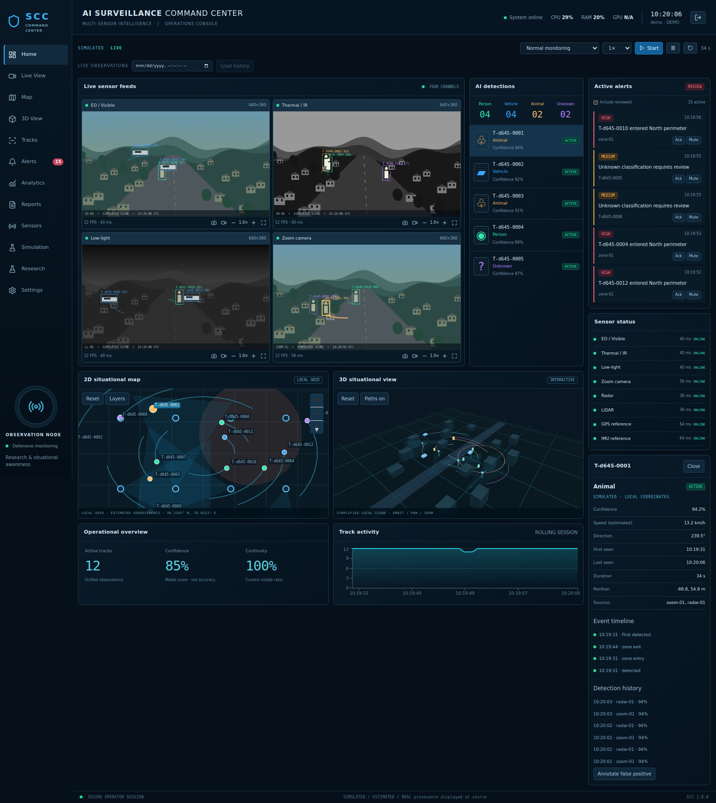
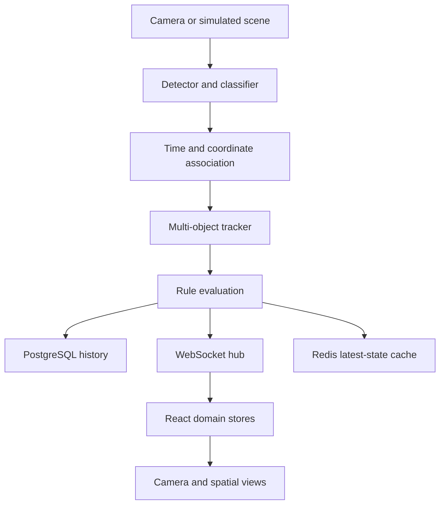

# AI Surveillance Command Center

A working, modular full-stack reference implementation for defensive observation, multi-sensor research, and situational awareness. Includes an immediately active simulation, four procedural camera views, persistent tracks, offline MapLibre mapping, Three.js visualization, alert review, historical detection playback, sensor administration, and research exports.

**Release: 1.0.0 — engineering baseline, not a certified or field-validated surveillance product.** The source is functional; real-world accuracy, high availability, 60 FPS across devices, and production security have not been certified. See [feature coverage](docs/FEATURE_COVERAGE.md) for the exact implementation boundary.

No weapon control, aiming, firing, engagement, or offensive functions are present.

## Quick start

Install Docker Desktop with Docker Compose v2 (Windows: Linux containers / WSL2), or Docker Engine and Compose on Linux. Extract this folder, open a terminal inside it, and run:

```sh
docker compose up
```

First startup builds both images and downloads dependencies. Open:

- Dashboard: http://localhost:8080
- API documentation: http://localhost:8000/docs
- OpenAPI JSON: http://localhost:8000/openapi.json
- Liveness: http://localhost:8000/health
- Readiness: http://localhost:8000/ready
- Prometheus metrics: http://localhost:8000/metrics

The dashboard obtains a limited demo session automatically. It starts in **SIMULATED** mode with 12 moving objects, eight sensors, four generated feeds, trajectories, historical observations, and alerts. No camera, GPU, map API key, or external map tile service is needed.

### Administrator access

Passwords and signing secrets are generated randomly into a persistent Docker volume. There are no source-controlled passwords. Retrieve your generated initial password locally:

```sh
docker compose exec backend cat /run/secrets/bootstrap_password
```

Sign out of the demo, then sign in with username `admin` and that password. The generated password is only used to create the initial account; restarting containers does not overwrite the database password hash. Rotate through `POST /api/auth/password` after first use. Do not share secret volume contents.

### Stop and restart

```sh
docker compose down
docker compose up -d
```

Database and secret volumes persist. **`docker compose down -v` deletes all stored observations, users, and secrets.** Back up first.

## Dashboard



The interface uses navy panels, cyan and green telemetry, amber/red alerts, a compact sidebar, and synchronized selection. The four camera scenes are procedural visualizations, not authentic EO/IR imagery or physically accurate radiometry.

- Select a camera box, detection card, map marker, table row, or 3D object to inspect a track.
- Feed controls: fullscreen, PNG snapshot, browser-local WebM recording, and digital zoom.
- Map: pan, zoom, reset, local georeference, labels, trajectories, monitoring zones, and illustrative coverage.
- 3D: orbit, pan, zoom, reset, simplified buildings/roads, sensor mounts, objects, paths, and zones.
- Alerts: acknowledge, mute, investigate, and track context.
- History: choose a local timestamp or timeline event. Map, scene, and reconstructed camera observations share that timestamp. Raw video is not retained server-side.
- Research: capture an experiment snapshot, add review annotations, export CSV or JSON.

## Repository structure

```text
surveillance-command-center/
  frontend/              React, TypeScript, Vite, Tailwind, Zustand, Query
    src/components/      Camera, map, 3D, chart, detail, alert, and UI primitives
    src/pages/           Dashboard, tracks, sensors, analytics, reports, research
    src/stores/          Domain state and shared selection/playback
    src/hooks/           WebSocket reconnect and historical observation query
    src/services/        Authenticated API and downloads
    e2e/                 Playwright operator workflow
  backend/app/
    api/                 Authenticated REST endpoints
    core/                Configuration, JWT, Argon2, rate limiting
    database/            Sessions and idempotent seed
    models/              Typed relational models
    schemas/             Pydantic input validation
    services/            Acquisition, persistence, rules, runtime
    websocket/           Bounded subscriber queues
  ai/                    Detector, tracker, classifier, fusion interfaces
  simulation/            Deterministic scene generator and scenario catalog
  database/              Alembic migrations and schema.sql
  docker/                Dockerfiles, proxy, secret initialization
  docs/                  Architecture, API, WebSocket, research, deployment
  tests/                 Pipeline, API, security, persistence, WebSocket tests
  media/                 Your locally mounted input video files
  docker-compose.yml
```

## Architecture



Simulation uses generated detections and calibrated synthetic local positions. File and RTSP sources run a CPU OpenCV HOG person baseline. No geographic location is inferred from an uncalibrated image bounding box. Such tracks remain **IMAGE** coordinates and do not appear on a geographic map.

The reference tracker uses class-gated nearest-neighbor association with motion prediction. It is deliberately replaceable, not mislabeled as ByteTrack. The fusion engine combines sufficiently close, time-synchronized observations from distinct sensors, using confidence-weighted coordinates. Confidence is a model score, **not accuracy**.

## Development without Docker

Use **Python 3.12** and **Node 22 LTS** for the pinned dependency set. In particular, do not use Python 3.14 with these OpenCV/NumPy pins.

Windows PowerShell:

```powershell
py -3.12 -m venv .venv
.\.venv\Scripts\Activate.ps1
python -m pip install -r backend/requirements.txt
python -m alembic -c database/alembic.ini upgrade head
python -m uvicorn backend.app.main:app --host 127.0.0.1 --port 8000
```

Linux/macOS:

```sh
python3.12 -m venv .venv
. .venv/bin/activate
python -m pip install -r backend/requirements.txt
python -m alembic -c database/alembic.ini upgrade head
python -m uvicorn backend.app.main:app --host 127.0.0.1 --port 8000
```

In another terminal:

```sh
cd frontend
npm ci
npm run dev -- --host 127.0.0.1
```

Open http://localhost:5173. Local development defaults to SQLite in `.data/scc.db`; Docker uses PostgreSQL. SQLite is a development convenience, not a production replacement. The local generated admin password is in `.data/bootstrap_password`. Local Redis is optional; a disconnected cache is reported without stopping acquisition.

## Configuration

| Variable             | Purpose / default                                                                                                  |
| -------------------- | ------------------------------------------------------------------------------------------------------------------ |
| `DATABASE_URL`       | SQLAlchemy connection URL; local SQLite by default; Compose constructs PostgreSQL credentials from the secret file |
| `REDIS_URL`          | Optional cache URL; Compose sets the internal Redis service                                                        |
| `JWT_SECRET`         | Optional externally supplied signing key; otherwise generated persistent secret                                    |
| `SECRET_DIR`         | Directory containing generated secrets                                                                             |
| `DATA_DIR`           | Local database and application data directory                                                                      |
| `DEMO_MODE`          | `true` enables restricted anonymous simulation login; disable for private real acquisition                         |
| `ADMIN_USERNAME`     | Initial administrator name, default `admin`                                                                        |
| `ADMIN_PASSWORD`     | Optional bootstrap password from your secret manager; Compose uses a generated file                                |
| `SESSION_MINUTES`    | Absolute session expiry, default 30 minutes                                                                        |
| `ALLOWED_RTSP_HOSTS` | Comma-separated exact hosts allowed for server-side RTSP acquisition                                               |
| `VIDEO_ROOT`         | Approved file source directory, `/media` in Docker                                                                 |

`API_URL` and `WS_URL` are not exposed as arbitrary browser destinations: clients use same-origin `/api` and `/ws`. Vite and Nginx perform proxying. Change their proxy targets when integrating into another deployment.

## Documentation

- [Architecture and data flow](docs/ARCHITECTURE.md)
- [Feature coverage and known limitations](docs/FEATURE_COVERAGE.md)
- [Database schema](docs/DATABASE.md), [SQL DDL](database/schema.sql)
- [REST API](docs/API.md), [OpenAPI specification](docs/openapi.json)
- [WebSocket protocol](docs/WEBSOCKET.md)
- [Simulation guide](docs/SIMULATION.md)
- [AI and real-sensor integration](docs/AI_INTEGRATION.md)
- [Research mode](docs/RESEARCH.md)
- [Testing and validation](docs/TESTING.md)
- [Deployment and operations](docs/DEPLOYMENT.md)
- [Future roadmap](docs/ROADMAP.md)

## Tests

```sh
python -m pytest tests -q
cd frontend
npm test
npm run build
```

With the development backend and frontend running:

```sh
npx playwright install chromium
npx playwright test
```

Use `BASE_URL=http://localhost:8080` for the Compose frontend. All tests are in the repository; no paid service is required. Hardware, GPU, long-duration load, and Docker-host tests are separate deployment gates.

Selecting REAL mode permanently disables anonymous demo access for that database, including after returning to simulation, to protect historical real observations. Continue using authenticated accounts. Use a separate fresh deployment for public demonstrations.
