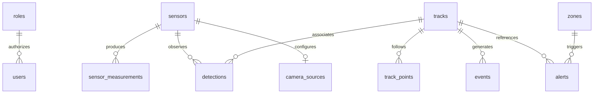

# Database

Docker uses PostgreSQL 16. Local development defaults to SQLite. SQLAlchemy owns typed mappings; Alembic owns migration execution. Seed operations are idempotent.

| Table | Key fields / purpose |
|---|---|
| users | username ID, Argon2 hash, role FK, enabled |
| roles | ADMIN, OPERATOR, ANALYST, VIEWER |
| sensors | ID, name, type, enabled, position/config JSON |
| camera_sources | sensor FK primary key, protocol, server-side endpoint |
| sensor_measurements | sensor FK, timestamp, health/measurement JSON |
| detections | observation ID, sensor FK, track FK, timestamp, detector JSON |
| tracks | namespaced ID, class, lifecycle status, first/last timestamps, state JSON |
| track_points | track FK, timestamp, local x/y |
| alerts | severity, type, timestamp, track/sensor/zone FKs, acknowledgment/mute |
| zones | ID, name, local circular zone geometry JSON |
| events | ID, timestamp, optional track FK, event type, audit/context JSON |
| system_metrics | timestamp and measurement summary JSON |
| simulation_scenarios | scenario catalog and persistent rule configuration |
| experiments | model/dataset/parameters/sensors/results snapshot JSON |
| annotations | review category, optional track reference in JSON, note |



Timestamps use UTC ISO-8601 strings to keep the development dialect compatible. For larger PostgreSQL deployments migrate them to timezone-aware native columns and partition observation tables by time. `schema.sql` is PostgreSQL DDL exported from these models; normal setup must still use Alembic.

```sh
python -m alembic -c database/alembic.ini upgrade head
```

The initial revision creates the model metadata. Before adding future revisions, freeze that revision into explicit `op.create_table` operations so historical migrations do not change with model edits. Review autogenerated future migrations before deployment.

Acquisition persists one transaction per tick. Retention removes raw detections, points, sensor measurements, and metric samples older than seven days. Summary tracks, alerts, audits, experiments, and annotations remain. Implement an approved archive/deletion policy before unattended long-term use.
